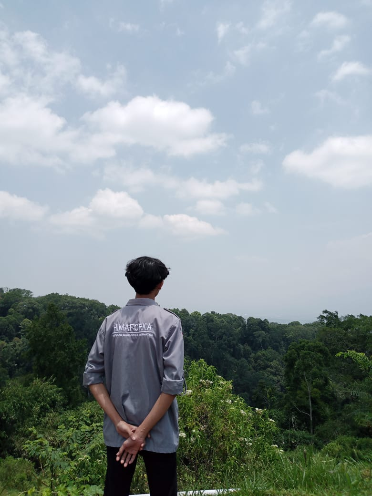

  
  
  
  
  

  

<h1 align="center">
    
</h1>
<h1 align="center">Hi , I'm 🅵🅸🅺🆁🅸 🅰🆁🅼🅸🅰 🅵🅰🅷🅼🅸</h1>
<h3 align="center">I studied the fields of Artificial Intelligence, Backend Development, and Frontend Development</h3>

  

- 🔭 I’m currently studying on [Universitas Pembangunan Jaya](https://upj.ac.id/)

- 🌱 I’m currently learning **Python, HTML, CSS, Javascript, PHP, Java, Typescript, C, C++, AHK, SQL**

- 🤝 I’m looking for help with [stackoverflow](https://stackoverflow.com/), [w3schools](https://www.w3schools.com/)

- 👨‍💻 All of my projects are available at [https://github.com/fikriaf](https://github.com/fikriaf)

- 📝 I regularly write articles on [OSC Medcom](https://osc.medcom.id/community/author/barayaroas@gmail.com), [Kumparan](https://kumparan.com/fikri-af), [Kompasiana](https://www.kompasiana.com/fikri44264), [GNFI](https://www.goodnewsfromindonesia.id/u/fikriaf27)

- 💬 Ask me about **Keras, Tensorflow, PyTorch, NLTK, NEAT, OpenCV, Pygame, Laravel, React, Bootstrap 5, Node.js, Express.js, Arduino, MySQL, MongoDB**

- 📫 How to reach me **fikriarmia27@gmail.com**

- ⚡ Fun fact **I think I overthinking**

- 📝 [My Resume](https://github.com/fikriaf/fikriaf/blob/main/sources/CV_Fikri.pdf)

  

##  Connect with me:

##  My Skills:
<table align="center">
  <tr>
    <td align="center" width="90">
      
       <strong>Python</strong>
    </td>
    <td align="center" width="90">
      
       <strong>PHP</strong>
    </td>
    <td align="center" width="90">
      
       <strong>HTML</strong>
    </td>
    <td align="center" width="90">
      
       <strong>CSS</strong>
    </td>
    <td align="center" width="90">
      
       <strong>JS</strong>
    </td>
    <td align="center" width="90">
      
       <strong>C</strong>
    </td>
    <td align="center" width="90">
      
       <strong>Java</strong>
    </td>
    <td align="center" width="90">
      
       <strong>TypeScript</strong>
    </td>
    <td align="center" width="90">
      
       <strong>Laravel</strong>
    </td>
  </tr>
  <tr>
    <td align="center" width="90">
      
       <strong>React</strong>
    </td>
    <td align="center" width="90">
      
       <strong>Maven</strong>
    </td>
    <td align="center" width="90">
      
       <strong>Express.js</strong>
    </td>
    <td align="center" width="90">
      
       <strong>Bootstrap</strong>
    </td>
    <td align="center" width="90">
      
       <strong>Filament</strong>
    </td>
    <td align="center" width="90">
      
       <strong>Tkinter</strong>
    </td>
    <td align="center" width="90">
      
       <strong>Pygame</strong>
    </td>
    <td align="center" width="90">
      
       <strong>TensorFlow</strong>
    </td>
    <td align="center" width="90">
      
       <strong>PyTorch</strong>
    </td>
  </tr>
  <tr>
    <td align="center" width="90">
      
       <strong>Sklearn</strong>
    </td>
    <td align="center" width="90">
      
       <strong>Keras</strong>
    </td>
    <td align="center" width="90">
      
       <strong>Transformers</strong>
    </td>
    <td align="center" width="90">
      
       <strong>NEAT</strong>
    </td>
    <td align="center" width="90">
      
       <strong>NLTK</strong>
    </td>
    <td align="center" width="90">
      
       <strong>OpenCV</strong>
    </td>
    <td align="center" width="90">
      
       <strong>MySQL</strong>
    </td>
    <td align="center" width="90">
      
       <strong>MongoDB</strong>
    </td>
    <td align="center" width="90">
      
       <strong>phpMyAdmin</strong>
    </td>
</tr>
<tr>
    <td align="center" width="90">
      
       <strong>Figma</strong>
    </td>
    <td align="center" width="90">
      
       <strong>Canva</strong>
    </td>
    <td align="center" width="90">
      
       <strong>Arduino</strong>
    </td>
  </tr>
</table>

  

##  Github Stats

## ⚡Activity Graph

### ✍️ Quote for Today

     
    
    
     
     
     
     
     

